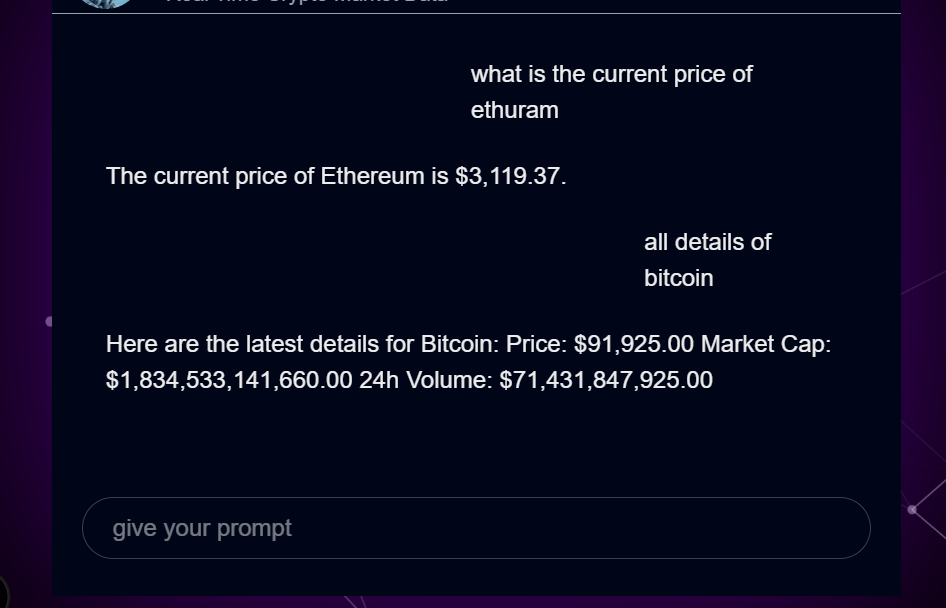

# CryptoTrade - Full Stack Cryptocurrency Trading Platform

A comprehensive cryptocurrency trading platform built with React.js frontend, Spring Boot backend, and AI-powered chatbot for real-time market insights.

## 🚀 Features

### Core Trading Features
- **Real-time Cryptocurrency Data** - Live market prices and charts
- **Buy/Sell Orders** - Execute cryptocurrency trades
- **Portfolio Management** - Track your investments and performance
- **Watchlist** - Monitor favorite cryptocurrencies
- **Trading History** - View all past transactions
- **Wallet Management** - Deposit, withdraw, and transfer funds

### Advanced Features
- **Interactive Charts** - ApexCharts integration for technical analysis
- **Two-Factor Authentication** - Enhanced security with OTP verification
- **Payment Integration** - Razorpay and Stripe payment gateways
- **Email Notifications** - Transaction confirmations and alerts
- **Admin Panel** - Withdrawal management and user oversight
- **AI Chatbot** - Real-time market data and trading assistance

### Security Features
- **JWT Authentication** - Secure user sessions
- **Password Reset** - Email-based password recovery
- **Account Verification** - Email and phone verification
- **Secure Transactions** - Encrypted payment processing

## 🏗️ Architecture

### Frontend (React.js)
- **Framework**: React 19.1.1 with Vite
- **State Management**: Redux with Redux Thunk
- **UI Components**: Radix UI + Tailwind CSS
- **Charts**: ApexCharts for market visualization
- **Routing**: React Router DOM
- **Forms**: React Hook Form with Zod validation

### Backend (Spring Boot)
- **Framework**: Spring Boot 3.5.5
- **Security**: Spring Security with JWT
- **Database**: MySQL with JPA/Hibernate
- **Payment**: Razorpay & Stripe integration
- **Email**: Spring Boot Mail
- **API**: RESTful web services

### AI Chatbot Service
- **Framework**: Spring Boot 3.5.7
- **Features**: Real-time crypto market data queries
- **Integration**: Standalone microservice

## 📁 Project Structure

```
Treading/
├── treading-react/          # React.js Frontend
│   ├── src/
│   │   ├── components/      # Reusable UI components
│   │   ├── page/           # Application pages
│   │   ├── State/          # Redux store and actions
│   │   └── utils/          # Utility functions
│   └── package.json
├── cryptoTrade/            # Spring Boot Backend
│   └── cryptoTrade/
│       ├── src/main/java/com/cryptotrade/
│       │   ├── controller/ # REST API endpoints
│       │   ├── service/    # Business logic
│       │   ├── repository/ # Data access layer
│       │   ├── modal/      # Entity models
│       │   └── config/     # Configuration classes
│       └── pom.xml
├── chatbot/                # AI Chatbot Service
│   ├── src/main/java/com/abhay/
│   │   ├── controller/     # Chatbot API endpoints
│   │   ├── Service/        # Chatbot logic
│   │   └── dto/           # Data transfer objects
│   └── pom.xml
├── react-frontend/         # Next.js Frontend (Alternative)
└── screenshort/           # Application screenshots
```

## 🛠️ Technology Stack

### Frontend Technologies
- **React.js 19.1.1** - Modern UI library
- **Vite** - Fast build tool and dev server
- **Redux** - State management
- **Tailwind CSS** - Utility-first CSS framework
- **Radix UI** - Accessible component library
- **ApexCharts** - Interactive charts
- **Axios** - HTTP client
- **React Router** - Client-side routing

### Backend Technologies
- **Spring Boot 3.5.5** - Java framework
- **Spring Security** - Authentication & authorization
- **Spring Data JPA** - Data persistence
- **MySQL** - Relational database
- **JWT** - JSON Web Tokens for auth
- **Lombok** - Reduce boilerplate code
- **Maven** - Dependency management

### Payment & External APIs
- **Razorpay** - Payment gateway
- **Stripe** - Payment processing
- **CoinGecko API** - Cryptocurrency data
- **Email Service** - SMTP integration

## 📱 Application Pages

### Public Pages
- **Login/Register** - User authentication
- **Forgot Password** - Password recovery

### Protected Pages
- **Dashboard** - Market overview and portfolio summary
- **Portfolio** - Investment tracking and performance
- **Trading** - Buy/sell cryptocurrency
- **Watchlist** - Monitor favorite coins
- **Activity** - Transaction history
- **Wallet** - Fund management
- **Withdrawal** - Cash out funds
- **Profile** - Account settings and verification
- **Payment Details** - Manage payment methods

### Admin Pages
- **Withdrawal Management** - Approve/reject withdrawals

## 🚀 Getting Started

### Prerequisites
- **Node.js** (v18 or higher)
- **Java 21**
- **MySQL** (v8.0 or higher)
- **Maven** (v3.6 or higher)

### Frontend Setup (React)

```bash
# Navigate to frontend directory
cd treading-react

# Install dependencies
npm install

# Create environment file
cp .env.example .env

# Configure environment variables
# VITE_API_BASE_URL=http://localhost:8080

# Start development server
npm run dev
```

### Backend Setup (Spring Boot)

```bash
# Navigate to backend directory
cd cryptoTrade/cryptoTrade

# Configure database in application.properties
spring.datasource.url=jdbc:mysql://localhost:3306/cryptotrade
spring.datasource.username=your_username
spring.datasource.password=your_password

# Configure JWT secret
jwt.secret=your_jwt_secret_key

# Configure email settings
spring.mail.host=smtp.gmail.com
spring.mail.username=your_email
spring.mail.password=your_app_password

# Configure payment gateways
razorpay.api.key=your_razorpay_key
razorpay.api.secret=your_razorpay_secret
stripe.api.key=your_stripe_key

# Run the application
mvn spring-boot:run
```

### Chatbot Setup

```bash
# Navigate to chatbot directory
cd chatbot

# Configure application.properties
server.port=8081

# Run the chatbot service
mvn spring-boot:run
```

### Database Setup

```sql
-- Create database
CREATE DATABASE cryptotrade;

-- The application will auto-create tables on first run
-- Make sure to configure proper user permissions
```

## 🔧 Configuration

### Environment Variables (Frontend)
```env
VITE_API_BASE_URL=http://localhost:8080
VITE_CHATBOT_URL=http://localhost:8081
```

### Application Properties (Backend)
```properties
# Database Configuration
spring.datasource.url=jdbc:mysql://localhost:3306/cryptotrade
spring.datasource.username=root
spring.datasource.password=password
spring.jpa.hibernate.ddl-auto=update

# JWT Configuration
jwt.secret=mySecretKey
jwt.expiration=86400000

# Email Configuration
spring.mail.host=smtp.gmail.com
spring.mail.port=587
spring.mail.username=your-email@gmail.com
spring.mail.password=your-app-password

# Payment Gateway Configuration
razorpay.api.key=your_razorpay_key
razorpay.api.secret=your_razorpay_secret
stripe.api.key=your_stripe_key
```

## 📊 API Endpoints

### Authentication
- `POST /auth/signup` - User registration
- `POST /auth/signin` - User login
- `POST /auth/forgot-password` - Password reset request
- `POST /auth/verify-otp` - OTP verification

### Trading
- `GET /api/coins` - Get cryptocurrency list
- `GET /api/coins/{id}` - Get coin details
- `POST /api/orders` - Create buy/sell order
- `GET /api/orders/user` - Get user orders

### Wallet
- `GET /api/wallet` - Get wallet balance
- `POST /api/wallet/deposit` - Deposit funds
- `POST /api/wallet/withdraw` - Withdraw funds
- `POST /api/wallet/transfer` - Transfer funds

### Watchlist
- `GET /api/watchlist/user` - Get user watchlist
- `POST /api/watchlist/add` - Add to watchlist
- `DELETE /api/watchlist/remove` - Remove from watchlist

## 📸 Screenshots

### Main Dashboard


### Trading Interface


### Market Charts


### User Authentication


### Navigation


### AI Chatbot


## 🔐 Security Features

- **JWT Authentication** - Secure token-based authentication
- **Password Encryption** - BCrypt password hashing
- **CORS Configuration** - Cross-origin request handling
- **Input Validation** - Server-side validation for all inputs
- **SQL Injection Prevention** - JPA/Hibernate protection
- **XSS Protection** - Content Security Policy headers

## 🚀 Deployment

### Frontend Deployment
```bash
# Build for production
npm run build

# Deploy to hosting service (Vercel, Netlify, etc.)
```

### Backend Deployment
```bash
# Package the application
mvn clean package

# Run the JAR file
java -jar target/cryptoTrade-0.0.1-SNAPSHOT.jar
```

### Docker Deployment (Optional)
```dockerfile
# Dockerfile for backend
FROM openjdk:21-jdk-slim
COPY target/cryptoTrade-0.0.1-SNAPSHOT.jar app.jar
EXPOSE 8080
ENTRYPOINT ["java", "-jar", "/app.jar"]
```

## 🤝 Contributing

1. Fork the repository
2. Create a feature branch (`git checkout -b feature/AmazingFeature`)
3. Commit your changes (`git commit -m 'Add some AmazingFeature'`)
4. Push to the branch (`git push origin feature/AmazingFeature`)
5. Open a Pull Request

## 📝 License

This project is licensed under the MIT License - see the [LICENSE](LICENSE) file for details.

## 👨‍💻 Author

**Your Name**
- GitHub: [@yourusername](https://github.com/yourusername)
- Email: your.email@example.com

## 🙏 Acknowledgments

- [CoinGecko API](https://www.coingecko.com/en/api) for cryptocurrency data
- [Razorpay](https://razorpay.com/) for payment processing
- [Stripe](https://stripe.com/) for payment gateway
- [ApexCharts](https://apexcharts.com/) for interactive charts
- [Tailwind CSS](https://tailwindcss.com/) for styling
- [Radix UI](https://www.radix-ui.com/) for accessible components

## 📞 Support

For support, email support@cryptotrade.com or join our Slack channel.

## 🔄 Version History

- **v1.0.0** - Initial release with core trading features
- **v1.1.0** - Added AI chatbot integration
- **v1.2.0** - Enhanced security and payment options

---

**⚠️ Disclaimer**: This is a demo trading platform for educational purposes. Do not use real money or sensitive information.